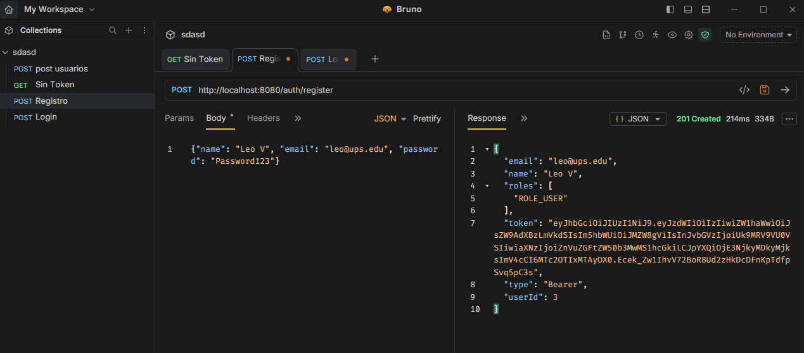
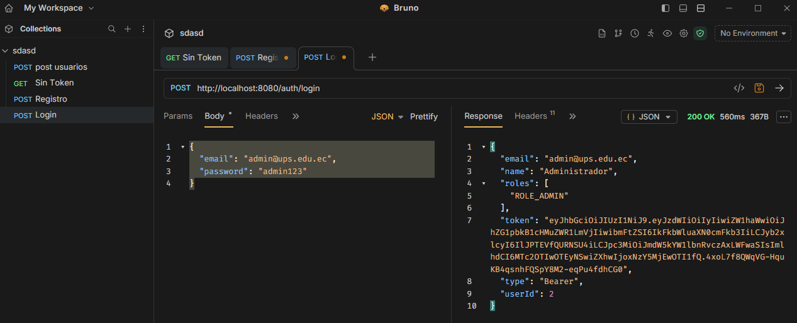
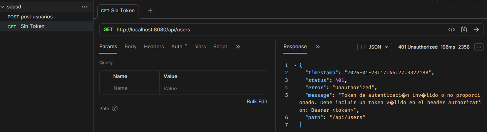

### 9.2. Evidencias de funcionamiento (Seguridad)

#### 1. Registro de nuevo usuario

*Descripción: Se observa la creación exitosa del usuario y la generación del token JWT inicial.*

#### 2. Autenticación (Login)

*Descripción: Validación de credenciales con BCrypt y retorno del AuthResponseDto con los roles asignados.*

#### 3. Acceso denegado (Sin Token)

*Descripción: Intento de consumo del endpoint /api/users sin header Authorization. El JwtAuthenticationEntryPoint intercepta la petición y retorna un 401 estructurado.*
